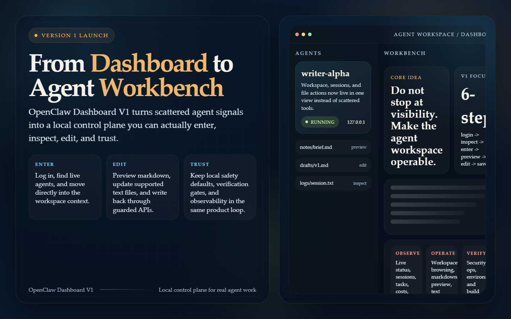
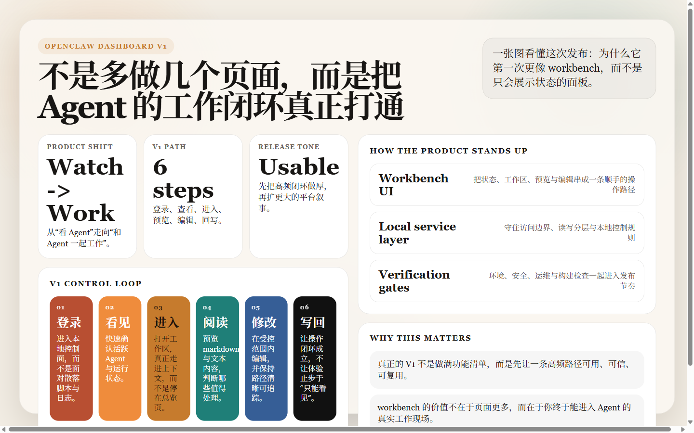

# OpenClaw Dashboard V1：Agent 不该只会跑，更该能看、能进、能改

很多 Agent 产品在第一版都会掉进同一个坑：界面看起来已经像产品了，但真正用起来，你只能看，不能进；只能观察，不能操作；只能知道“它在跑”，却不知道“它到底在做什么”。**OpenClaw Dashboard V1 想解决的，正是这个问题。**

这次发布不是单纯加了一个 dashboard，而是把 Agent 的一条关键使用路径真正打通了：登录本地控制面、看到活跃 Agent、进入工作区、阅读内容、编辑文件、再安全地把结果写回去。对用户来说，这意味着 Agent 不再只是一个悬浮在命令行和日志之上的抽象对象，而是第一次变成了一个可进入、可判断、可操作的工作台。

如果你只想先记住一句话，那就是：**V1 的重点不是“展示更多状态”，而是把 Agent Workspace 变成一个真正可用的入口。**

## 这次 V1 真正改变的，是你和 Agent 之间的距离

过去很多工具的问题，不在于功能完全没有，而在于它们之间没有形成闭环。你可以看到 Agent 列表，可以看到一些状态，可以看到日志片段，但这些能力彼此之间是松散的。它们更像是零件，而不是一个工作面。

OpenClaw Dashboard V1 的思路相反：先不追求把所有能力铺满，而是先把最有价值的一条路径做完整。现在，用户可以通过本地 token 登录，进入 `/dashboard`，看到 Agent 卡片与状态更新；选中目标 Agent 之后，继续打开工作区抽屉，查看递归文件树，预览 markdown 和文本内容，并在允许的范围内完成修改与保存。

这件事看起来像是把几个功能拼在了一起，但真正重要的是：它改变了产品的性质。你不再只是“知道有一个 Agent 正在运行”，而是开始真正接近它的工作上下文。你可以知道它在哪个工作区、有哪些文件、哪些内容值得看、哪些内容需要改，以及改完之后是否真的成功写回。

这也是为什么我更愿意把它叫做 workbench，而不是 dashboard。dashboard 更像是观看界面，workbench 更像是工作界面。V1 的价值，就在于把 OpenClaw Dashboard 往后者推了一大步。

## 为什么我们没有把 V1 做成一个“大而全”的平台

第一版最容易犯的错误，就是把“想做的都写进路线图”，最后交付出一个看起来什么都有、实际什么都不稳的版本。我们这次刻意反着来：**V1 先解决高频场景，不先解决所有场景。**

所以你会看到，这一版的重点非常明确：Agent Workspace、内容浏览、文本编辑、本地控制和运行时观察。它解决的是“我怎么真正走进一个 Agent 的工作现场”这个问题，而不是直接承诺一个面向所有团队、所有权限模型、所有部署方式的超级平台。

这种取舍带来的好处，是产品在第一版就具备真实使用价值，而不是停留在“以后会很强”的故事里。你可以把它理解成一种更克制的发布方式：不是先做一个庞大的空壳，而是先把一条最重要的路径做厚。

当然，这也意味着边界必须说清。V1 现在聚焦的是本地可信环境；它优先支持的是 markdown 与纯文本类工作区内容；它解决的是进入、观察和受控修改，而不是一开始就把完整远程协作、组织权限和公网部署全部装进去。

但恰恰是这种边界，让版本变得可信。因为一个值得发布的 V1，不是“什么都想碰一下”，而是“知道自己先把什么做到位”。

## 这次前后端拆分，服务的是体验和安全，而不是架构表演

从产品实现上看，OpenClaw Dashboard 采用的是“前端工作台 + 本地服务层 + 共享数据约定”的三层结构。听起来像常规工程拆分，但它真正服务的不是“结构好看”，而是两件非常现实的事：**交互效率**和**本地安全**。

前端要快，要能把 Agent 状态、工作区视图、内容预览、编辑交互组织成一个足够顺手的操作流；后端要稳，要在本地文件访问、读写控制、运行状态读取和鉴权保护之间守住边界。这两件事的演化速度本来就不一样，所以它们应该被拆开。

这样带来的结果是，用户看到的是更完整的工作流，而不是一组互相割裂的页面。登录页负责把入口收住，Agent 列表负责把目标收住，工作区抽屉负责把上下文收住，编辑器和预览负责把内容操作收住；本地服务层则在后面负责访问保护、读取与修改路径分层、Agent 发现、运行状态采集，以及数据落盘这些更底层的事情。

换句话说，这一版的架构并不是为了证明“我们也有前后端分层”，而是为了让体验能持续变好，同时让安全和控制边界不被前端直接冲穿。

## 一套控制面是否可信，取决于它有没有把“安全”当成功能的一部分

如果一个产品能查看工作区、修改文件、触发控制操作，却把安全放到“以后再做”，那它从第一天起就已经埋下了问题。OpenClaw Dashboard V1 在这里做了一个非常明确的选择：**本地工具不等于可以省略防线。**

目前这套系统把最基础的约束前置了。它默认只服务本地环境，关键操作需要受保护的访问方式，敏感信息会尽量被遮蔽，发布前也有明确的环境、安全和运维校验入口。这些东西对最终用户来说也许不一定是“最性感”的卖点，但它们决定了这个产品是不是一个可以放心继续往下迭代的底座。

这也是为什么我觉得 V1 的价值不只是“功能能用了”，而是“功能终于开始在一个可控边界里可用”。一个控制面真正难的地方，不是把按钮做出来，而是让按钮背后的系统默认不轻易出错。

当然，边界依然存在。V1 的安全模型主要针对本地可信场景，它不是一个已经完全覆盖公网、多租户和组织级权限治理的终局答案。但第一版先把默认边界立住，远比先把能力摊大更重要。

## 比起一篇功能列表，我更愿意把 V1 理解成一次产品气质的确立

有些版本的意义，在于“多了多少功能”；有些版本的意义，在于“这个产品从此像什么”。我更倾向于后者。OpenClaw Dashboard V1 想确立的，不是一个更热闹的 Agent 页面，而是一种更稳定的产品气质：**Agent 应该被看见、被进入、被理解，也应该被安全地操作。**

这套气质决定了后面很多事情都会不一样。后续版本不再需要从零回答“这个产品到底是看板、编辑器还是控制台”，因为 V1 已经给出了方向：它是一个围绕 Agent Workspace 的本地控制平面。后面无论是扩展更多观测能力、更强的控制流，还是更细的权限边界，都是在这个判断上继续长，而不是每次都重新找定位。

如果你问这次发布最值得记住的是什么，我会给出一个很具体的答案：**我们终于不再满足于做一个“只能看”的 Agent 面板了。** 这不是一句文案，它是这次 V1 所有取舍背后的共同原则。

## 这次发布之后，你应该怎样理解 OpenClaw Dashboard

如果你是第一次看到这个项目，可以这样理解它：它不是一个单纯展示 Agent 状态的页面集合，而是一个让你真正进入 Agent 工作上下文的本地工作台。你能看到状态，但不止于状态；你能读内容，但不止于阅读；你能动手修改，但修改又被放在受控边界里。

这就是 V1 的判断，也是这篇文章真正想传达的东西：**一个好用的 Agent 产品，不该只让你“知道它在运行”，还应该让你“能与它一起工作”。**

### 这次 V1 最值得带走的 5 个判断

1. 第一版最重要的不是做大，而是先把最关键的操作闭环做通。
2. dashboard 的上限只是“可看”，workbench 的价值才是“可工作”。
3. 本地产品也需要安全默认值，因为可控边界本身就是用户体验的一部分。
4. 真正有用的架构拆分，服务的是体验和安全，不是结构表演。
5. 一个版本值得发布，不是因为它承诺了很多未来，而是因为它已经把一条真实路径做到了可用。

### 看完这篇之后，值得继续追问的 3 个问题

1. 下一版最应该优先打开的，是更深的工作区能力，还是更强的运行观测？
2. 如果未来从本地走向协作场景，这套控制面应该先补权限，还是先补同步能力？
3. 对 Agent 产品来说，真正的“可用”边界，应该由谁来定义：开发者、操作者，还是工作流本身？
